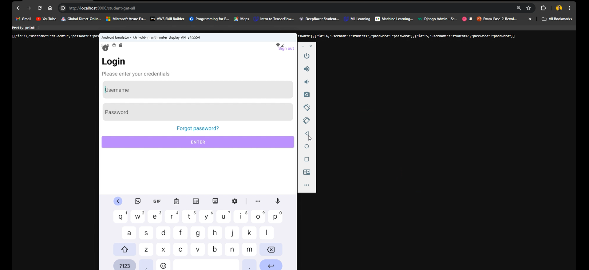

# Spring boot server and Android client app
This is a tutorial project created for teaching Spring boot server and its capabilities. This project has Spring boot server and Android client application.

### Demo of Running App [UmerMehmood1]
## Server functionalities ##
 - Work with MySQL Database using Spring JPA
 - Provide REST API using Spring Web

## Client functionalities ##
 - Provides a form to create new student
 - Lists all the student objects in a RecyclerView
 - Lists all the courses objects in a RecyclerView